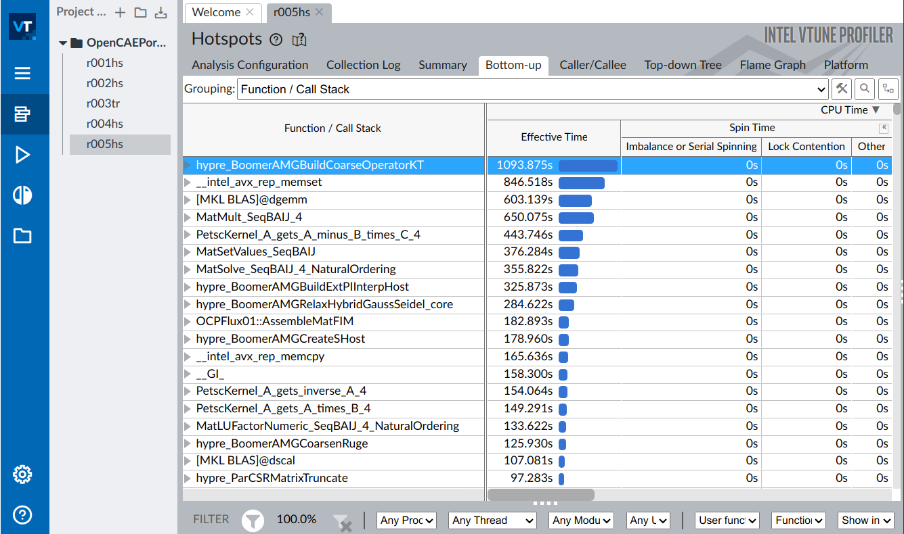

# Exp06 Profiler

## 1. Introduction to profiler

Profiling is an important aspect of software programming. Through profiling one can determine the parts in program code that are time consuming and need to be re-written. This helps make your program execution faster which is always desired.

In very large projects, profiling can save your day by not only determining the parts in your program which are slower in execution than expected but also can help you find many other statistics through which many potential bugs can be spotted and sorted out.

In this article, we will explore the GNU profiling tool ‘gprof’, Intel® VTune™ Profiler and NVIDIA Nsight™ Systems **(prof is not included)**.

## 2. GNU profiling tool: gprof

> [!IMPORTANT]
>
> This part is modified from [GPROF Tutorial – How to use Linux GNU GCC Profiling Tool (thegeekstuff.com)](https://www.thegeekstuff.com/2012/08/gprof-tutorial/).

### 2.1 How to use gprof

Using the gprof tool is not at all complex. You just need to do the following on a high-level:

- Have profiling enabled while compiling the code
- Execute the program code to produce the profiling data
- Run the gprof tool on the profiling data file (generated in the step above).

The last step above produces an analysis file which is in human readable form. This file contains a couple of tables (flat profile and call graph) in addition to some other information. While flat profile gives an overview of the timing information of the functions like time consumption for the execution of a particular function, how many times it was called etc. On the other hand, call graph focuses on each function like the functions through which a particular function was called, what all functions were called from within this particular function etc So this way one can get idea of the execution time spent in the sub-routines too.

Lets try and understand the three steps listed above through a practical example. Following test code will be used throughout the article :

```c
//test_gprof.c
#include<stdio.h>

void new_func1(void);

void func1(void)
{
    printf("\n Inside func1 \n");
    int i = 0;

    for(;i<0xffffffff;i++);
    new_func1();

    return;
}

static void func2(void)
{
    printf("\n Inside func2 \n");
    int i = 0;

    for(;i<0xffffffaa;i++);
    return;
}

int main(void)
{
    printf("\n Inside main()\n");
    int i = 0;

    for(;i<0xffffff;i++);
    func1();
    func2();

    return 0;
}
//test_gprof_new.c
#include<stdio.h>

void new_func1(void)
{
    printf("\n Inside new_func1()\n");
    int i = 0;

    for(;i<0xffffffee;i++);

    return;
}
```

Note that the ‘for’ loops inside the functions are there to consume some execution time.

### 2.2 Step1 : Profiling enabled while compilation

In this first step, we need to make sure that the profiling is enabled when the compilation of the code is done. This is made possible by adding the ‘-pg’ option in the compilation step.

From the man page of gcc :

> -pg : Generate extra code to write profile information suitable for the analysis program gprof. You must use this option when compiling the source files you want data about, and you must also use it when linking.

So, lets compile our code with ‘-pg’ option :

```shell
$ gcc -Wall -pg test_gprof.c test_gprof_new.c -o test_gprof
$
```

Please note : The option ‘-pg’ can be used with the gcc command that compiles (-c option), gcc command that links(-o option on object files) and with gcc command that does the both(as in example above).

### 2.3 Step2 : Execute the code

In the second step, the binary file produced as a result of step-1 (above) is executed so that profiling information can be generated.

```shell
$ ls
test_gprof  test_gprof.c  test_gprof_new.c

$ ./test_gprof 

 Inside main()

 Inside func1 

 Inside new_func1()

 Inside func2 

$ ls
gmon.out  test_gprof  test_gprof.c  test_gprof_new.c

$
```

So we see that when the binary was executed, a new file ‘gmon.out’ is generated in the current working directory.

Note that while execution if the program changes the current working directory (using chdir) then gmon.out will be produced in the new current working directory. Also, your program needs to have sufficient permissions for gmon.out to be created in current working directory.

### 2.4 Step3 : Run the gprof tool

In this step, the gprof tool is run with the executable name and the above generated ‘gmon.out’ as argument. This produces an analysis file which contains all the desired profiling information.

```shell
$  gprof test_gprof gmon.out > analysis.txt
```

Note that one can explicitly specify the output file (like in example above) or the information is produced on stdout.

```shell
$ ls
analysis.txt  gmon.out  test_gprof  test_gprof.c  test_gprof_new.c
```

So we see that a file named ‘analysis.txt’ was generated.

On a related note, you should also understand [how to debug your C program using gdb](https://www.thegeekstuff.com/2010/03/debug-c-program-using-gdb/).

### 2.5 Comprehending the profiling information

As produced above, all the profiling information is now present in ‘analysis.txt’. Lets have a look at this text file :

```
Flat profile:

Each sample counts as 0.01 seconds.
%    cumulative self          self   total
time seconds    seconds calls s/call s/call name
33.86 15.52     15.52    1    15.52  15.52  func2
33.82 31.02     15.50    1    15.50  15.50  new_func1
33.29 46.27     15.26    1    15.26  30.75  func1
0.07  46.30     0.03                        main

% the percentage of the total running time of the
time program used by this function.

cumulative a running sum of the number of seconds accounted
seconds for by this function and those listed above it.

self the number of seconds accounted for by this
seconds function alone. This is the major sort for this
listing.

calls the number of times this function was invoked, if
this function is profiled, else blank.

self the average number of milliseconds spent in this
ms/call function per call, if this function is profiled,
else blank.

total the average number of milliseconds spent in this
ms/call function and its descendents per call, if this
function is profiled, else blank.

name the name of the function. This is the minor sort
for this listing. The index shows the location of
the function in the gprof listing. If the index is
in parenthesis it shows where it would appear in
the gprof listing if it were to be printed.

Call graph (explanation follows)

granularity: each sample hit covers 2 byte(s) for 0.02% of 46.30 seconds

index % time self children called name

[1]   100.0  0.03  46.27          main [1]
             15.26 15.50    1/1      func1 [2]
             15.52 0.00     1/1      func2 [3]
-----------------------------------------------
             15.26 15.50    1/1      main [1]
[2]   66.4   15.26 15.50    1     func1 [2]
             15.50 0.00     1/1      new_func1 [4]
-----------------------------------------------
             15.52 0.00     1/1      main [1]
[3]   33.5   15.52 0.00     1     func2 [3]
-----------------------------------------------
             15.50 0.00     1/1      func1 [2]
[4] 33.5     15.50 0.00     1     new_func1 [4]
-----------------------------------------------

This table describes the call tree of the program, and was sorted by
the total amount of time spent in each function and its children.

Each entry in this table consists of several lines. The line with the
index number at the left hand margin lists the current function.
The lines above it list the functions that called this function,
and the lines below it list the functions this one called.
This line lists:
index A unique number given to each element of the table.
Index numbers are sorted numerically.
The index number is printed next to every function name so
it is easier to look up where the function in the table.

% time This is the percentage of the `total' time that was spent
in this function and its children. Note that due to
different viewpoints, functions excluded by options, etc,
these numbers will NOT add up to 100%.

self This is the total amount of time spent in this function.

children This is the total amount of time propagated into this
function by its children.

called This is the number of times the function was called.
If the function called itself recursively, the number
only includes non-recursive calls, and is followed by
a `+' and the number of recursive calls.

name The name of the current function. The index number is
printed after it. If the function is a member of a
cycle, the cycle number is printed between the
function's name and the index number.

For the function's parents, the fields have the following meanings:

self This is the amount of time that was propagated directly
from the function into this parent.

children This is the amount of time that was propagated from
the function's children into this parent.

called This is the number of times this parent called the
function `/' the total number of times the function
was called. Recursive calls to the function are not
included in the number after the `/'.

name This is the name of the parent. The parent's index
number is printed after it. If the parent is a
member of a cycle, the cycle number is printed between
the name and the index number.

If the parents of the function cannot be determined, the word
`' is printed in the `name' field, and all the other
fields are blank.

For the function's children, the fields have the following meanings:

self This is the amount of time that was propagated directly
from the child into the function.

children This is the amount of time that was propagated from the
child's children to the function.

called This is the number of times the function called
this child `/' the total number of times the child
was called. Recursive calls by the child are not
listed in the number after the `/'.

name This is the name of the child. The child's index
number is printed after it. If the child is a
member of a cycle, the cycle number is printed
between the name and the index number.

If there are any cycles (circles) in the call graph, there is an
entry for the cycle-as-a-whole. This entry shows who called the
cycle (as parents) and the members of the cycle (as children.)
The `+' recursive calls entry shows the number of function calls that
were internal to the cycle, and the calls entry for each member shows,
for that member, how many times it was called from other members of
the cycle.

Index by function name

[2] func1 [1] main
[3] func2 [4] new_func1
```

So (as already discussed) we see that this file is broadly divided into two parts :

1. Flat profile
2. Call graph

The individual columns for the (flat profile as well as call graph) are very well explained in the output itself.

### 2.6 Customize gprof output using flags

There are various flags available to customize the output of the gprof tool. Some of them are discussed below:

#### 2.6.1 Suppress the printing of statically(private) declared functions using -a

If there are some static functions whose profiling information you do not require then this can be achieved using -a option :

```shell
$ gprof -a test_gprof gmon.out > analysis.txt
```

Now if we see that analysis file :

```
Flat profile:

Each sample counts as 0.01 seconds.
%        cumulative self           self    total
time  seconds       seconds calls  s/call  s/call  name
67.15 30.77         30.77     2    15.39  23.14    func1
33.82 46.27         15.50     1    15.50  15.50    new_func1
0.07   46.30         0.03                          main

...
...
...

Call graph (explanation follows)

granularity: each sample hit covers 2 byte(s) for 0.02% of 46.30 seconds

index   %time        self  children  called  name

[1]     100.0        0.03   46.27             main [1]
                     30.77  15.50     2/2      func1 [2]
-----------------------------------------------------
                     30.77  15.50     2/2      main [1]
[2]     99.9         30.77  15.50     2      func1 [2]
                     15.50   0.00     1/1      new_func1 [3]
----------------------------------------------------
                     15.50   0.00     1/1      func1 [2]
[3]        33.5      15.50 0.00       1      new_func1 [3]
-----------------------------------------------

...
...
...
```

So we see that there is no information related to func2 (which is defined static)

#### 2.6.2 Suppress verbose blurbs using -b

As you would have already seen that gprof produces output with lot of verbose information so in case this information is not required then this can be achieved using the -b flag.

```shell
$ gprof -b test_gprof gmon.out > analysis.txt
```

Now if we see the analysis file :

```
Flat profile:

Each sample counts as 0.01 seconds.
%       cumulative    self            self    total
time    seconds       seconds  calls  s/call  s/call   name
33.86 15.52            15.52      1    15.52  15.52    func2
33.82 31.02            15.50      1    15.50  15.50    new_func1
33.29 46.27            15.26      1    15.26  30.75    func1
0.07   46.30            0.03                           main

Call graph

granularity: each sample hit covers 2 byte(s) for 0.02% of 46.30 seconds
index % time self children called name

[1]   100.0  0.03  46.27          main [1]
             15.26 15.50    1/1      func1 [2]
             15.52 0.00     1/1      func2 [3]
-----------------------------------------------
             15.26 15.50    1/1      main [1]
[2]   66.4   15.26 15.50    1     func1 [2]
             15.50 0.00     1/1      new_func1 [4]
-----------------------------------------------
             15.52 0.00     1/1      main [1]
[3]   33.5   15.52 0.00     1     func2 [3]
-----------------------------------------------
             15.50 0.00     1/1      func1 [2]
[4] 33.5     15.50 0.00     1     new_func1 [4]
-----------------------------------------------
Index by function name

[2] func1 [1] main
[3] func2 [4] new_func1
```

So we see that all the verbose information is not present in the analysis file.

#### 2.6.3 Print only flat profile using -p

In case only flat profile is required then :

```
$ gprof -p -b test_gprof gmon.out > analysis.txt
```

Note that I have used(and will be using) -b option so as to avoid extra information in analysis output.

Now if we see that analysis output:

```
Flat profile:

Each sample counts as 0.01 seconds.
%       cumulative    self            self   total
time    seconds       seconds  calls  s/call  s/call  name
33.86   15.52          15.52      1   15.52   15.52    func2
33.82   31.02          15.50      1   15.50   15.50    new_func1
33.29   46.27          15.26      1   15.26   30.75    func1
0.07    46.30          0.03                            main
```

So we see that only flat profile was there in the output.

#### 2.6.4 Print information related to specific function in flat profile

This can be achieved by providing the function name along with the -p option:

```shell
$ gprof -pfunc1 -b test_gprof gmon.out > analysis.txt
```

Now if we see that analysis output :

```
Flat profile:

Each sample counts as 0.01 seconds.
%          cumulative     self            self     total
time       seconds        seconds  calls  s/call   s/call  name
103.20     15.26          15.26     1     15.26   15.26    func1
```

So we see that a flat profile containing information related to only function func1 is displayed.

#### 2.6.5 Suppress flat profile in output using -P

If flat profile is not required then it can be suppressed using the -P option :

```shell
$ gprof -P -b test_gprof gmon.out > analysis.txt
```

Now if we see the analysis output :

```
Call graph

granularity: each sample hit covers 2 byte(s) for 0.02% of 46.30 seconds
index % time self children called name

[1]   100.0  0.03  46.27          main [1]
             15.26 15.50    1/1      func1 [2]
             15.52 0.00     1/1      func2 [3]
-----------------------------------------------
             15.26 15.50    1/1      main [1]
[2]   66.4   15.26 15.50    1     func1 [2]
             15.50 0.00     1/1      new_func1 [4]
-----------------------------------------------
             15.52 0.00     1/1      main [1]
[3]   33.5   15.52 0.00     1     func2 [3]
-----------------------------------------------
             15.50 0.00     1/1      func1 [2]
[4] 33.5     15.50 0.00     1     new_func1 [4]
-----------------------------------------------
Index by function name

[2] func1 [1] main
[3] func2 [4] new_func1
```

So we see that flat profile was suppressed and only call graph was displayed in output.

Also, if there is a requirement to print flat profile but excluding a particular function then this is also possible using -P flag by passing the function name (to exclude) along with it.

```shell
$ gprof -Pfunc1 -b test_gprof gmon.out > analysis.txt
```

In the above example, we tried to exclude ‘func1’ by passing it along with the -P option to gprof. Now lets see the analysis output:

```
Flat profile:

Each sample counts as 0.01 seconds.
%         cumulative      self              self    total
time      seconds         seconds   calls   s/call  s/call  name
50.76     15.52            15.52      1     15.52   15.52   func2
50.69     31.02            15.50      1     15.50   15.50   new_func1
0.10      31.05            0.03                             main
```

So we see that flat profile was displayed but information on func1 was suppressed.

#### 2.6.6 Print only call graph information using -q

```shell
gprof -q -b test_gprof gmon.out > analysis.txt
```

In the example above, the option -q was used. Lets see what effect it casts on analysis output:

```
Call graph

granularity: each sample hit covers 2 byte(s) for 0.02% of 46.30 seconds
index % time self children called name

[1]   100.0  0.03  46.27          main [1]
             15.26 15.50    1/1      func1 [2]
             15.52 0.00     1/1      func2 [3]
-----------------------------------------------
             15.26 15.50    1/1      main [1]
[2]   66.4   15.26 15.50    1     func1 [2]
             15.50 0.00     1/1      new_func1 [4]
-----------------------------------------------
             15.52 0.00     1/1      main [1]
[3]   33.5   15.52 0.00     1     func2 [3]
-----------------------------------------------
             15.50 0.00     1/1      func1 [2]
[4] 33.5     15.50 0.00     1     new_func1 [4]
-----------------------------------------------
Index by function name

[2] func1 [1] main
[3] func2 [4] new_func1
```

So we see that only call graph was printed in the output.

#### 2.6.7 Print only specific function information in call graph

This is possible by passing the function name along with the -q option.

```
$ gprof -qfunc1 -b test_gprof gmon.out > analysis.txt
```

Now if we see the analysis output:

```
Call graph

granularity: each sample hit covers 2 byte(s) for 0.02% of 46.30 seconds
index % time self children called name

             15.26 15.50    1/1      main [1]
[2]   66.4   15.26 15.50    1     func1 [2]
             15.50 0.00     1/1      new_func1 [4]
-----------------------------------------------
             15.50 0.00     1/1      func1 [2]
[4]   33.5   15.50 0.00     1     new_func1 [4]
-----------------------------------------------
Index by function name

[2] func1 (1) main
(3) func2 [4] new_func1
```

So we see that information related to only func1 was displayed in call graph.

#### 2.6.8 Suppress call graph using -Q

If the call graph information is not required in the analysis output then -Q option can be used.

```shell
$ gprof -Q -b test_gprof gmon.out > analysis.txt
```

Now if we see the analysis output :

```
Flat profile:

Each sample counts as 0.01 seconds.
%       cumulative    self            self    total
time    seconds       seconds  calls  s/call  s/call   name
33.86 15.52            15.52      1   15.52   15.52    func2
33.82 31.02            15.50      1   15.50   15.50    new_func1
33.29 46.27            15.26      1   15.26   30.75    func1
0.07   46.30            0.03                           main
```

So we see that only flat profile is there in the output. The whole call graph got suppressed.

Also, if it is desired to suppress a specific function from call graph then this can be achieved by passing the desired function name along with the -Q option to the gprof tool.

```shell
$ gprof -Qfunc1 -b test_gprof gmon.out > analysis.txt
```

In the above example, the function name func1 is passed to the -Q option.

Now if we see the analysis output:

```
Call graph

granularity: each sample hit covers 2 byte(s) for 0.02% of 46.30 seconds
index % time self children called name

[1]   100.0  0.03  46.27          main [1]
             15.26 15.50    1/1      func1 [2]
             15.52 0.00     1/1      func2 [3]
-----------------------------------------------
             15.52 0.00     1/1      main [1]
[3]   33.5   15.52 0.00     1     func2 [3]
-----------------------------------------------
             15.50 0.00     1/1      func1 [2]
[4]   33.5   15.50 0.00     1     new_func1 [4]
-----------------------------------------------
Index by function name

(2) func1 [1] main
[3] func2 [4] new_func1
```

So we see that call graph information related to func1 was suppressed.

## 3. Intel VTune Profiler

> [!IMPORTANT]
>
> This part is modified from [Intel® VTune™ Profiler User Guide](https://www.intel.com/content/www/us/en/docs/vtune-profiler/user-guide/2024-1/overview.html). For the newest information about Intel VTune Profiler, please visit the official website. (FYI: The link's version is 2024-1)

### 3.1 Introduction

Intel® VTune™ Profiler is a performance analysis tool for serial and multithreaded applications. Use VTune Profiler to analyze your choice of algorithm. Identify potential benefits for your application from available hardware resources.

You can use VTune Profiler to locate or determine:

- The most time-consuming (hot) functions in your application and/or on the whole system
- Sections of code that do not effectively utilize available processor time
- The best sections of code to optimize for sequential performance and for threaded performance
- Synchronization objects that affect the application performance
- Whether, where, and why your application spends time on input/output operations
- Whether your application is CPU or GPU bound and how effectively it offloads code to the GPU
- The performance impact of different synchronization methods, different numbers of threads, or different algorithms
- Thread activity and transitions
- Hardware-related issues in your code such as data sharing, cache misses, branch misprediction, and others

### 3.2 Installing Intel VTune Profiler

#### 3.2.1 Intel oneAPI Base Toolkit

You can download Intel oneAPI Base Toolkit from this link: [Download the Intel® oneAPI Base Toolkit](https://www.intel.com/content/www/us/en/developer/tools/oneapi/base-toolkit-download.html). 

On the webiste, different operating system versions and installation/package types are provided. However, I strongly suggest that you should use the offline installer and install everything by the following commands.

```shell
wget https://registrationcenter-download.intel.com/akdlm/IRC_NAS/fdc7a2bc-b7a8-47eb-8876-de6201297144/l_BaseKit_p_2024.1.0.596_offline.sh

# You should only choose one from the following two commands
# for root users
sudo sh ./l_BaseKit_p_2024.1.0.596_offline.sh -a --silent --cli --eula accept

# for non-root users
sh ./l_BaseKit_p_2024.1.0.596_offline.sh -a --silent --cli --eula accept
```

#### 3.2.2 Intel HPC Toolkit

You can download Intel HPC Toolkit from this link: [Download the Intel® HPC Toolkit](https://www.intel.com/content/www/us/en/developer/tools/oneapi/hpc-toolkit-download.html) 

On the webiste, different operating system versions and installation/package types are provided. However, I strongly suggest that you should use the offline installer and install everything by the following commands.

```shell
wget https://registrationcenter-download.intel.com/akdlm/IRC_NAS/7f096850-dc7b-4c35-90b5-36c12abd9eaa/l_HPCKit_p_2024.1.0.560_offline.sh

# You should only choose one from the following two commands
# for root users
sudo sh ./l_HPCKit_p_2024.1.0.560_offline.sh -a --silent --cli --eula accept

# for non-root users
sh ./l_HPCKit_p_2024.1.0.560_offline.sh -a --silent --cli --eula accept
```

### 3.3 Open Intel VTune Profiler

Open Intel® VTune™ Profiler with the graphical user interface (vtune-gui) or command-line interface (vtune).

Once you have downloaded Intel VTune Profiler follow these steps to run the application:

1. [Locate the installation directory.](https://www.intel.com/content/www/us/en/docs/vtune-profiler/user-guide/2024-1/launch.html#INSTALL)
2. [Set environment variables.](https://www.intel.com/content/www/us/en/docs/vtune-profiler/user-guide/2024-1/launch.html#ENV)
3. Open Intel® VTune™ Profiler
   - [From the GUI](https://www.intel.com/content/www/us/en/docs/vtune-profiler/user-guide/2024-1/launch.html#GUI)
   - [From the command line](https://www.intel.com/content/www/us/en/docs/vtune-profiler/user-guide/2024-1/launch.html#CLI)

#### 3.3.1 Default Installation Paths

Whether you downloaded Intel® VTune™ Profiler as a standalone component or with the Intel® oneAPI Base Toolkit, the default path for your <install-dir> is:

| Operating System |                    Path to <install-dir>                     |
| :--------------: | :----------------------------------------------------------: |
|   Windows* OS    | C:\Program Files (x86)\Intel\oneAPI\ or C:\Program Files\Intel\oneAPI\(in certain systems) |
|    Linux* OS     | /opt/intel/oneapi/ for root users or $HOME/intel/oneapi/ for non-root users |

#### 3.3.2 Set Environment Variables

To set up environment variables for VTune ProfilerVTune Profiler, you need to run the setvars script:

**Linux OS:**

```shell
source <install-dir>/setvars.sh

# For Example: for root users
source /opt/intel/oneapi/setvars.sh
# or : for non-root users
source /opt/intel/oneapi/setvars.sh
```

Meanwhile, it's a good idea to use `alias` to help the environment variables' quick setting.

```shell
# Add the Following Content to ~/.bashrc
alias Intel_oneAPI='source <install-dir>/setvars.sh'
source ~/.bashrc

# Set Environment Variables
Intel_oneAPI
```

**Windows OS:**

```shell
<install-dir>\setvars.bat
```

When you run this script, it displays the product name and the build number. You can now use the vtune and vtune-gui commands.

#### 3.3.3 Open VTune Profiler from the GUI

On Windows OS, use the **Search** menu or locate VTune Profiler from the **Start** menu to run the standalone GUI client. When you start Intel® VTune™ Profiler, a Welcome page opens with several links to product news, resources, and directions for your next steps.


For the version of VTune Profiler that is [integrated into Microsoft* Visual Studio* IDE](https://www.intel.com/content/www/us/en/docs/vtune-profiler/user-guide/2024-1/microsoft-visual-studio-integration.html) on Windows OS, do one of the following:

- Select **Intel VTune Profiler** from the **Tools** menu of Visual Studio.
- Click the **Configure Analysis with VTune Profiler** toolbar button.


On a macOS* system, start **Intel VTune Profiler \*version\*** from the Launchpad.

> [!NOTE]
>
> You can also[ launch the VTune Profiler from the Eclipse* IDE](https://www.intel.com/content/www/us/en/docs/vtune-profiler/user-guide/2024-1/eclipse-and-intel-system-studio-ide-integration.html#GUID-A17CE05F-2DAB-4B61-B3E4-1208E6140AAD).
>
> 

#### 3.3.4 Open VTune Profiler from the Command Line

To launch the VTune Profiler from the command line, run the following scripts from the <*install-dir*>/bin64 directory:

- vtune-gui for the [standalone graphical interface](https://www.intel.com/content/www/us/en/docs/vtune-profiler/user-guide/2024-1/standalone-ui.html)
- vtune for the [command line interface](https://www.intel.com/content/www/us/en/docs/vtune-profiler/user-guide/2024-1/command-line-interface.html)

**To open a specific VTune Profiler project or a result file (mainly for Linux OS), enter:**

```shell
vtune-gui <*path*>
```

where <*path*> is one of the following:

- full path to a result file (*.vtune)
- full path to a project file (*.vtuneproj)
- full path to a project directory. If the project file does not exist in the directory, the **New Project** dialog box opens and prompts you to [create a new project](https://www.intel.com/content/www/us/en/docs/vtune-profiler/user-guide/2024-1/set-up-project.html) in the given directory.

For example, to open the matrix project in the VTune Profiler GUI on Linux, run:

```shell
vtune-gui /root/intel/vtune/projects/matrix/matrix.vtuneproj
```

### 3.4 Set Up Project

Before you run an analysis with Intel® VTune™ Profiler, you must first create a *project*. This is a container for an analysis target, analysis type configuration, and data collection results. You use the VTune Profiler user interface to create a project. You cannot create one from the command line.

For Microsoft Visual Studio* IDE, VTune Profiler creates a project for an active startup project, inherits Visual Studio settings and uses the application generated for the selected project as your analysis target. The default project directory is My VTune Results-[project name] in the solution directory.

For the standalone graphical interface, create a project by specifying its name and path to an analysis target. The default project directory is %USERPROFILE%\My Documents\Amplifier XE\Projects on Windows* and $HOME/intel/vtune/projects on Linux*.

**To create a VTune Profiler project for the standalone GUI:**

1. Click **New Project...** in the **Welcome** screen.

   

   

   

2. In the **Create a Project** dialog box, configure these settings:

   |                 Use This                 |                          To Do This                          |
   | :--------------------------------------: | :----------------------------------------------------------: |
   |          **Project Name** field          |               Enter the name of a new project.               |
   | **Location** field and **Browse** button | Choose or create a directory to contain the project.TIP:Store all your project directories in the same location. |
   |        **Create Project** button         | Create a container *.vtuneproj file and open the [Configure Analysis](https://www.intel.com/content/www/us/en/docs/vtune-profiler/user-guide/2024-1/configure-analysis.html) window. |

3. Click the **Create Project** button.

   The **Configure Analysis** window opens.

Your default project is pre-configured for the [Performance Snapshot](https://www.intel.com/content/www/us/en/docs/vtune-profiler/user-guide/2024-1/performance-snapshot.html) analysis. This presents an overview of issues that affect the performance of your application. Click the **Start** button to proceed with the default setup.

To select a different analysis type, click on the name of the analysis in the analysis header section. This opens an Analysis Tree with all available analysis types.

### 3.5 Set Up Analysis Target

When you create a project for the Intel® VTune™ Profiler performance analysis, you have to specify what you want to profile - your *analysis target*, which could be an executable file, a process, or a whole system.

#### 3.5.1 Supported Targets

Before starting an analysis, make sure your target and system are compiled/configured properly for performance profiling.

VTune Profiler supports analysis targets that you can run in these environments:

| **Development Environment Integration** | [Microsoft* Visual Studio*](https://www.intel.com/content/www/us/en/docs/vtune-profiler/user-guide/2024-1/microsoft-visual-studio-integration.html)[Eclipse*](https://www.intel.com/content/www/us/en/docs/vtune-profiler/user-guide/2024-1/eclipse-and-intel-system-studio-ide-integration.html) |
| --------------------------------------- | ------------------------------------------------------------ |
| **Target Platform**                     | [Linux* OS](https://www.intel.com/content/www/us/en/docs/vtune-profiler/user-guide/2024-1/remote-linux-target-setup.html)[Windows* OS](https://www.intel.com/content/www/us/en/docs/vtune-profiler/user-guide/2024-1/windows-targets.html)[Android* OS](https://www.intel.com/content/www/us/en/docs/vtune-profiler/user-guide/2024-1/android-targets.html)[FreeBSD*](https://www.intel.com/content/www/us/en/docs/vtune-profiler/user-guide/2024-1/freebsd-targets.html)[QNX*](https://www.intel.com/content/www/us/en/docs/vtune-profiler/user-guide/2024-1/qnx-targets.html)[Intel® Xeon Phi® processors](https://www.intel.com/content/www/us/en/docs/vtune-profiler/user-guide/2024-1/intel-xeon-phi-processor-knights-landing-targets.html) (code name: Knights Landing) |
| **Programming Language**                | C/C++FortranC# ([Windows Store applications](https://www.intel.com/content/www/us/en/docs/vtune-profiler/user-guide/2024-1/windows-store-applications-support.html))[Java*](https://www.intel.com/content/www/us/en/docs/vtune-profiler/user-guide/2024-1/java-code-analysis.html)JavaScript[Python*](https://www.intel.com/content/www/us/en/docs/vtune-profiler/user-guide/2024-1/python-code-analysis.html)[Go*](https://www.intel.com/content/www/us/en/docs/vtune-profiler/user-guide/2024-1/go-applications-support.html)[.NET*](https://www.intel.com/content/www/us/en/docs/vtune-profiler/user-guide/2024-1/net-code-analysis.html).NET Core |
| **Programming Model**                   | Windows* API[OpenMP* API](https://www.intel.com/content/www/us/en/docs/vtune-profiler/cookbook/current/openmp-code-analysis-method.html)Intel Cilk™ Plus[OpenCL™ API](https://www.intel.com/content/www/us/en/docs/vtune-profiler/user-guide/2024-1/gpu-opencl-application-analysis-view.html)[Message Passing Interface (MPI)](https://www.intel.com/content/www/us/en/docs/vtune-profiler/user-guide/2024-1/mpi-code-analysis.html)[Intel Threading Building Blocks](https://www.intel.com/content/www/us/en/docs/vtune-profiler/user-guide/2024-1/intel-threading-building-blocks-code-analysis.html)[Intel Media SDK API](https://www.intel.com/content/www/us/en/docs/vtune-profiler/user-guide/2024-1/intel-media-sdk-program-analysis.html) |
| **Virtual Environment**                 | [VMWare*](https://www.intel.com/content/www/us/en/docs/vtune-profiler/user-guide/2024-1/on-vmware.html)[Parallels*](https://www.intel.com/content/www/us/en/docs/vtune-profiler/user-guide/2024-1/on-parallels-system.html)[KVM*](https://www.intel.com/content/www/us/en/docs/vtune-profiler/user-guide/2024-1/on-kvm-project-system.html)[Hyper-V*](https://www.intel.com/content/www/us/en/docs/vtune-profiler/user-guide/2024-1/profiling-on-hyper-v.html)[Xen*](https://www.intel.com/content/www/us/en/docs/vtune-profiler/user-guide/2024-1/on-xen-virtualization-platform.html) |
| **Containers**                          | [LXC*, Docker*, Mesos*](https://www.intel.com/content/www/us/en/docs/vtune-profiler/user-guide/2024-1/profiling-container-targets.html) |

#### 3.5.2 Specify the Target

To specify your target for analysis:

1. Click the  **New Project** button on the toolbar to create a new [project](https://www.intel.com/content/www/us/en/docs/vtune-profiler/user-guide/2024-1/set-up-project.html).

   If you need to re-configure the target for an existing project, click the  **Configure Analysis** toolbar button.

   The **Configure Analysis** window opens. By default, the project is pre-configured to run the [Performance Snapshot](https://www.intel.com/content/www/us/en/docs/vtune-profiler/user-guide/2024-1/performance-snapshot.html) analysis.

2. If you do not run an analysis on the local host, expand the **WHERE** pane and select an appropriate target system.

   The target system can be the same as the *host system*, which is a system where the VTune Profiler GUI is installed. If you run an analysis on the same system where the VTune Profiler is installed (i.e. target system=host system), such a target system is called *local*. Target systems other than local are called *remote systems*. But both local and remote systems are *accessible* targets, which means you can access them either directly (local) or via a connection (for example, SSH connection to a remote target).

   | **Local Host**                     | Run an analysis on the local host system.NOTE:This type of the target system is not available for macOS*. |
   | ---------------------------------- | ------------------------------------------------------------ |
   | **Remote Linux (SSH)**             | Run an analysis on a remote regular or embedded Linux* system. VTune Profiler uses the SSH protocol to connect to your remote system. Make sure to fill in the **SSH Destination** field with the username, hostname, and port (if required) for your remote Linux target system as username@hostname[:port]. |
   | **Android Device (ADB)**           | Run an analysis on an Android device. VTune Profiler uses the Android Debug Bridge* (adb) to connect to your Android device. Make sure to specify an Android device targeted for analysis in the **ADB Destination** field. When the ADB connection is set up, the VTune Profiler automatically detects available devices and displays them in the menu. |
   | **Arbitrary Host (not connected)** | Create a command line configuration for a platform NOT accessible from the current host, which is called an *arbitrary target*. |

3. From the **WHAT** pane, specify an application to launch or click the  Browse button to select a different target type:

   | **Launch Application** (pre-selected) | Enable the **Launch Application** pane and choose and configure an application to analyze, which can be either a binary file or a script.NOTE:This target type is not supported for the Hotspots analysis of Android applications. Use the **Attach to Process** or **Launch Android Package** types instead. |
   | ------------------------------------- | ------------------------------------------------------------ |
   | **Attach to Process**                 | Enable the **Attach to Process** pane and choose and configure a process to analyze. |
   | **Profile System**                    | Enable the **Profile System** pane and configure the system-wide analysis that monitors all the software executing on your system. |
   | **Launch Android Package**            | Enable the **Launch Android Package** pane to specify the name of the Android* package to analyze and configure target options. |
   

> [!NOTE]
>
> If you use VTune Profiler as a [web server](https://www.intel.com/content/www/us/en/docs/vtune-profiler/user-guide/2024-1/web-server-ui.html), the list of available targets and target systems differs.

> [!NOTE]
>
> For [driverless event-based sampling data collection](https://www.intel.com/content/www/us/en/docs/vtune-profiler/cookbook/current/profiling-hardware-without-sampling-drivers.html), VTune Profiler supports local and remote Launch Application, Attach to Process and Profile System target types but their support fully depends on the Linux Perf profiling credentials specified in the /proc/sys/kernel/perf_event_paranoid file and managed by the administrator of your system using root credentials. For more information see the *perf_event related configuration files* topic at http://man7.org/linux/man-pages/man2/perf_event_open.2.html. By default, only user processes profiling at the both user and kernel spaces is permitted, so you need granting wider profiling credentials via the perf_event_paranoid file to employ the Profile System target type.

### 3.6 Analyze Performance

After you [create a project](https://www.intel.com/content/www/us/en/docs/vtune-profiler/user-guide/2024-1/set-up-project.html) and [specify a target for analysis](https://www.intel.com/content/www/us/en/docs/vtune-profiler/user-guide/2024-1/set-up-analysis-target.html), you are ready to run your first analysis.

#### 3.6.1 Performance Snapshot

Click **Configure Analysis** on the Welcome page. By default, this action opens the [Performance Snapshot](https://www.intel.com/content/www/us/en/docs/vtune-profiler/user-guide/2024-1/performance-snapshot.html) analysis type. This is a good starting point to get an overview of potential performance issues that affect your application. The snapshot view includes recommendations for other analysis types you should consider next.

#### 3.6.2 Analysis Groups

Click anywhere on the analysis header that contains the name of the analysis type. This opens the **Analysis Tree**, where you can see other analysis types grouped into several categories. See [Analysis types](https://www.intel.com/content/www/us/en/docs/vtune-profiler/user-guide/2024-1/analysis-types.html) to get an overview of these predefined options.

Advanced users can create [custom analysis types](https://www.intel.com/content/www/us/en/docs/vtune-profiler/user-guide/2024-1/custom-analysis.html) which appear at the bottom of the analysis tree.

|                        Analysis Group                        |                        Analysis Types                        |
| :----------------------------------------------------------: | :----------------------------------------------------------: |
| [Algorithm ](https://www.intel.com/content/www/us/en/docs/vtune-profiler/user-guide/2024-1/algorithm-group.html)analysis | [Hotspots](https://www.intel.com/content/www/us/en/docs/vtune-profiler/user-guide/2024-1/basic-hotspots-analysis.html)[Anomaly Detection](https://www.intel.com/content/www/us/en/docs/vtune-profiler/user-guide/2024-1/anomaly-detection-analysis.html)[Memory Consumption](https://www.intel.com/content/www/us/en/docs/vtune-profiler/user-guide/2024-1/memory-consumption-analysis.html) |
| [Microarchitecture](https://www.intel.com/content/www/us/en/docs/vtune-profiler/user-guide/2024-1/microarchitecture-analysis-group.html) analysis | [Microarchitecture Exploration](https://www.intel.com/content/www/us/en/docs/vtune-profiler/user-guide/2024-1/general-exploration-analysis.html)[Memory Access](https://www.intel.com/content/www/us/en/docs/vtune-profiler/user-guide/2024-1/memory-access-analysis.html) |
| [Parallelism](https://www.intel.com/content/www/us/en/docs/vtune-profiler/user-guide/2024-1/parallelism-analysis-group.html) analysis | [Threading](https://www.intel.com/content/www/us/en/docs/vtune-profiler/user-guide/2024-1/threading-analysis.html)[HPC Performance Characterization](https://www.intel.com/content/www/us/en/docs/vtune-profiler/user-guide/2024-1/hpc-performance-characterization-analysis.html) |
| [I/O](https://www.intel.com/content/www/us/en/docs/vtune-profiler/user-guide/2024-1/input-and-output-analysis.html) analysis | [Input and Output](https://www.intel.com/content/www/us/en/docs/vtune-profiler/user-guide/2024-1/input-and-output-analysis.html) |
| [Accelerators](https://www.intel.com/content/www/us/en/docs/vtune-profiler/user-guide/2024-1/accelerators-group.html) analysis | [GPU Offload](https://www.intel.com/content/www/us/en/docs/vtune-profiler/user-guide/2024-1/gpu-offload-analysis.html)[GPU Compute/Media Hotspots (Preview)](https://www.intel.com/content/www/us/en/docs/vtune-profiler/user-guide/2024-1/gpu-compute-media-hotspots-analysis.html)[CPU/FPGA Interaction](https://www.intel.com/content/www/us/en/docs/vtune-profiler/user-guide/2024-1/cpu-fpga-interaction-analysis.html)[NPU Exploration Analysis (Preview)](https://www.intel.com/content/www/us/en/docs/vtune-profiler/user-guide/2024-1/npu-exploration-analysis.html) |
| [Platform Analyses](https://www.intel.com/content/www/us/en/docs/vtune-profiler/user-guide/2024-1/platform-analysis-group.html) | [System Overview](https://www.intel.com/content/www/us/en/docs/vtune-profiler/user-guide/2024-1/system-overview-analysis.html) |

> [!IMPORTANT]
>
> The most three important result is **Bottom-up , Top-down Tree and Flame Graph**. By analyzing the time used, you can know which function uses most of the time **(NOT ALL TRUTH HOWEVER)**.



## 4. NVIDIA Nsight Systems

> [!IMPORTANT]
>
> Useful Guide:
>
> - [User Guide — nsight-systems 2024.4 documentation (nvidia.com)](https://docs.nvidia.com/nsight-systems/UserGuide/index.html)
> - XiaoLi Zhi's Experiment Document
>
> Waiting for updating...

