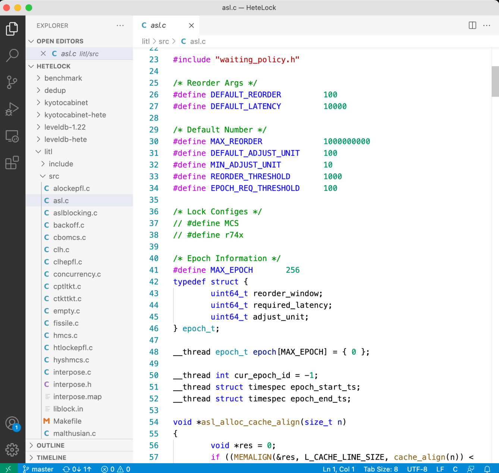
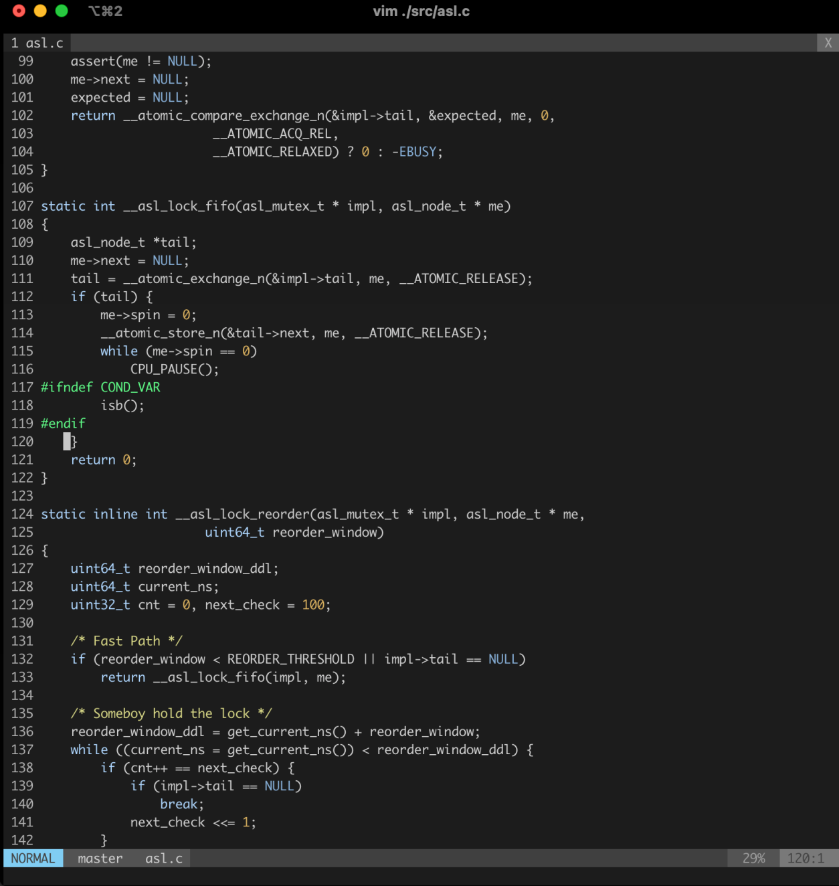
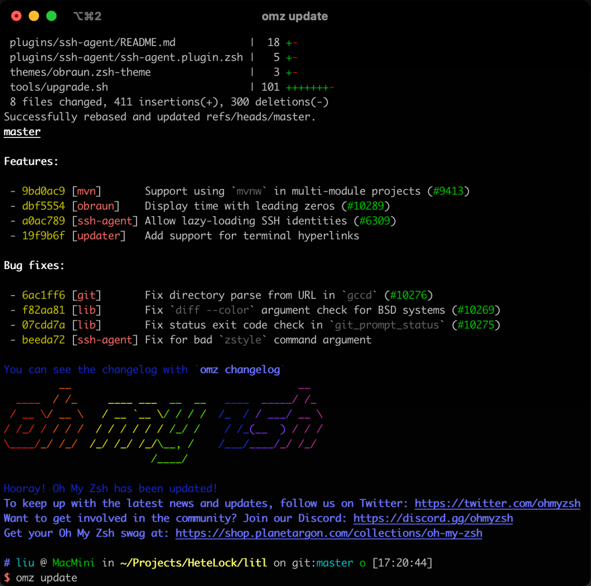

# Exp07 Tutor: Shell

**PLEASE NOTE:** 

1. The following content is modified from **[MIT's The Missing Semester of Your CS Education](https://missing.csail.mit.edu/)** and **[IPADS Freshman Tutorial](https://www.bilibili.com/video/BV1y44y1v7c3)**. Thanks for their sharing.
2. It is not a detailed tutorial, find out more details (e.g. about how to use each tools, more useful commands and techniques) by yourself.
3. Useful books for learning: [Linux Command Line Books by William Shotts](https://linuxcommand.org/tlcl.php)、TLCL (billie66.github.io)](https://billie66.github.io/TLCL/)

## 1. Introduction to the shell

### 1.1 GUI vs CLI: Which is better?

#### 1.1.1 GUI

- Graph (e.g., code analysis tools)
- More intuitive user-interface, especially in complex software



#### 1.1.2 CLI

- Data analysis
- Home-brew app
- When connecting to a server



> [!TIP]
>
> **When both are available (e.g., editor), use the one suit you best!**

### 1.2 Shell: The system user-interface in CLI

- Capability: Launch app, execute command, manage foreground/background tasks
- A lot of shell available
  - Common shells are shown as follows: Bourne Shell (sh), C Shell (csh), Korn Shell (ksh), Bourne Again Shell (bash), Debian Almquist Shell (dash), Z-shell  (Zsh), PowerShell, etc.
  - Mostly similar
  - Differences: build-in commands, script grammar, extensions
  - Chose the one you like
- Useful extensions of **[Oh My Zsh (a delightful & open source framework for Zsh)](https://ohmyz.sh/)**: history, autosuggestion, vim-like, etc.



In this section, we will focus on the **Bourne Again SHell**, or “**bash**” for short. This is one of the most widely used shells, and its syntax is similar to what you will see in many other shells. 

## 2. Using the shell

To open a shell ***prompt*** (where you can type commands), you first need a ***terminal***. Your device probably shipped with one installed, or you can install one fairly easily.

> [!NOTE]
>
> **Terminal (emulator):** emulate a (texted-based) terminal inside the GUI environment

When you launch the **terminal**, you will see a ***prompt*** that often looks a little like this:

```shell
ubuntu@VM-16-9-ubuntu:~$ 
```

This is the main textual interface to the shell. It tells you that you are on the machine `VM-16-9-ubuntu` (hostname) and that your “current working directory”, or where you currently are, is `~` (short for “home”). The `$` tells you that you are not the root user (more on that later). At this prompt you can type a *command*, which will then be interpreted by the shell. 

In some cases, more information may be proviced like this:

```shell
Welcome to Ubuntu 22.04.4 LTS (GNU/Linux 5.15.0-94-generic x86_64)

 * Documentation:  https://help.ubuntu.com
 * Management:     https://landscape.canonical.com
 * Support:        https://ubuntu.com/pro

  System information as of Wed Jun  5 05:09:08 PM CST 2024

  System load:  0.0                Users logged in:                  0
  Usage of /:   6.6% of 117.99GB   IPv4 address for br-a293a732bd08: 172.18.0.1
  Memory usage: 9%                 IPv4 address for docker0:         172.17.0.1
  Swap usage:   0%                 IPv4 address for eth0:            10.0.16.9
  Processes:    121

 * Strictly confined Kubernetes makes edge and IoT secure. Learn how MicroK8s
   just raised the bar for easy, resilient and secure K8s cluster deployment.

   https://ubuntu.com/engage/secure-kubernetes-at-the-edge

Last login: Sat May 25 15:18:44 2024 from 172.18.0.1
ubuntu@VM-16-9-ubuntu:~$
```

It is worth noting that the first line gives both the name and version of **Linux Distribution** (Ubuntu 22.04.4 LTS) and **Linux Kernel's version** (GNU/Linux 5.15.0-94-generic x86_64). A complete Linux system package called a distribution. Most Linux users run a kernel provided by their Linux distribution. Some distributions run on the common kernel (aka "vanilla" or "stable") version of Linux. However, some Linux kernel distributors, such as Red Hat and SUSE, maintain their own kernel branches. The kernel versions of these publisher branches are usually slower to update than the stable version (vanilla), but will also include patches for all relevant stable branches. In addition, they will also add new features and support for new hardware that is not included in the stable branch on which these publisher branches are based. For more information about Linux Distribution, please refer to [the timeline of the development of main Linux distributions](https://github.com/FabioLolix/LinuxTimeline).

## 3. Executing a program

The most basic command is to execute a program:

```shell
ubuntu@VM-16-9-ubuntu:~$ date
Wed Jun  5 05:09:18 PM CST 2024
ubuntu@VM-16-9-ubuntu:~$
```

Here, we executed the `date` program, which (perhaps unsurprisingly) prints the current date and time. The shell then asks us for another command to execute. We can also execute a command with *arguments*:

```shell
ubuntu@VM-16-9-ubuntu:~$ echo hello
hello
ubuntu@VM-16-9-ubuntu:~$ 
```

In this case, we told the shell to execute the program `echo` with the argument `hello`. The `echo` program simply prints out its arguments. The shell parses the command by splitting it by whitespace, and then runs the program indicated by the first word, supplying each subsequent word as an argument that the program can access. If you want to provide an argument that contains spaces or other special characters (e.g., a directory named “My Photos”), you can either quote the argument with `'` or `"` (`"My Photos"`), or escape just the relevant characters with `\` (`My\ Photos`).

But how does the shell know how to find the `date` or `echo` programs? Well, the shell is a programming environment, just like Python or Ruby, and so it has variables, conditionals, loops, and functions (next part!). When you run commands in your shell, you are really writing a small bit of code that your shell interprets. If the shell is asked to execute a command that doesn’t match one of its programming keywords, it consults an *environment variable* called `$PATH` that lists which directories the shell should search for programs when it is given a command:

```shell
ubuntu@VM-16-9-ubuntu:~$ echo $PATH
/usr/local/sbin:/usr/local/bin:/usr/sbin:/usr/bin:/sbin:/bin:/usr/games:/usr/local/games:/snap/bin
ubuntu@VM-16-9-ubuntu:~$ which echo
/usr/bin/echo
ubuntu@VM-16-9-ubuntu:~$ /bin/echo $PATH
/usr/local/sbin:/usr/local/bin:/usr/sbin:/usr/bin:/sbin:/bin:/usr/games:/usr/local/games:/snap/bin
```

When we run the `echo` command, the shell sees that it should execute the program `echo`, and then searches through the `:`-separated list of directories in `$PATH` for a file by that name. When it finds it, it runs it (assuming the file is *executable*; more on that later). We can find out which file is executed for a given program name using the `which` program. We can also bypass `$PATH` entirely by giving the *path* to the file we want to execute.

## 4. Navigating in the shell

A path on the shell is a delimited list of directories; separated by `/` on Linux and macOS and `\` on Windows. On Linux and macOS, the path `/` is the “root” of the file system, under which all directories and files lie, whereas on Windows there is one root for each disk partition (e.g., `C:\`). We will generally assume that you are using a Linux filesystem in this class. A path that starts with `/` is called an *absolute* path. Any other path is a *relative* path. Relative paths are relative to the current working directory, which we can see with the `pwd` command and change with the `cd` command. In a path, `.` refers to the current directory, and `..` to its parent directory:

```shell
ubuntu@VM-16-9-ubuntu:~$ pwd
/home/ubuntu
ubuntu@VM-16-9-ubuntu:~$ cd /home
ubuntu@VM-16-9-ubuntu:/home$ pwd
/home
ubuntu@VM-16-9-ubuntu:/home$ cd ..
ubuntu@VM-16-9-ubuntu:/$ pwd
/
ubuntu@VM-16-9-ubuntu:/$ cd ./home
ubuntu@VM-16-9-ubuntu:/home$ pwd
/home
ubuntu@VM-16-9-ubuntu:/home$ cd SHUSCT
ubuntu@VM-16-9-ubuntu:/home/SHUSCT$ pwd
/home/SHUSCT
ubuntu@VM-16-9-ubuntu:/home/SHUSCT$ ../../bin/echo hello
hello
```

Notice that our shell prompt kept us informed about what our current working directory was. You can configure your prompt to show you all sorts of useful information, which we will cover in a later part.

In general, when we run a program, it will operate in the current directory unless we tell it otherwise. For example, it will usually search for files there, and create new files there if it needs to.

To see what lives in a given directory, we use the `ls` command:

```shell
ubuntu@VM-16-9-ubuntu:~$ ls
ubuntu@VM-16-9-ubuntu:~$ cd ..
ubuntu@VM-16-9-ubuntu:/home$ ls
SHUSCT  ubuntu
ubuntu@VM-16-9-ubuntu:/home$ cd ..
ubuntu@VM-16-9-ubuntu:/$ ls
bin  boot  data  dev  etc  home  lib  lib32  lib64  libx32  lost+found  media  mnt  opt  proc  root  run  sbin  snap  srv  sys  tmp  usr  var
```

Unless a directory is given as its first argument, `ls` will print the contents of the current directory. Most commands accept flags and options (flags with values) that start with `-` to modify their behavior. Usually, running a program with the `-h` or `--help` flag will print some help text that tells you what flags and options are available. For example, `ls --help` tells us:

```shell
  -l                         use a long listing format
  
ubuntu@VM-16-9-ubuntu:~$ ls -l /home
total 8
drwxr-xr-x 2 root   root   4096 Jun  5 17:31 SHUSCT
drwxr-x--- 9 ubuntu ubuntu 4096 Jun  5 17:33 ubuntu
```

`ls -l` or `ll` (available in some distrubution, which is mplemented by `alias`) gives us a bunch more information about each file or directory present. First, the `d` at the beginning of the line tells us that `missing` is a directory. Then follow three groups of three characters (`rwx`). These indicate what permissions the owner of the file (`missing`), the owning group (`users`), and everyone else respectively have on the relevant item. A `-` indicates that the given principal does not have the given permission. Above, only the owner is allowed to modify (`w`) the `missing` directory (i.e., add/remove files in it). To enter a directory, a user must have “search” (represented by “execute”: `x`) permissions on that directory (and its parents). To list its contents, a user must have read (`r`) permissions on that directory. For files, the permissions are as you would expect. Notice that nearly all the files in `/bin` have the `x` permission set for the last group, “everyone else”, so that anyone can execute those programs.

Some other handy programs to know about at this point are `mv` (to rename/move a file), `cp` (to copy a file), and `mkdir` (to make a new directory).

If you ever want *more* information about a program’s arguments, inputs, outputs, or how it works in general, give the `man` program a try. It takes as an argument the name of a program, and shows you its *manual page*. Press `q` to exit.

```shell
ubuntu@VM-16-9-ubuntu:~$ man ls
```

## 5. Connecting programs

In the shell, programs have two primary “streams” associated with them: their input stream and their output stream. When the program tries to read input, it reads from the input stream, and when it prints something, it prints to its output stream. Normally, a program’s input and output are both your terminal. That is, your keyboard as input and your screen as output. However, we can also rewire those streams!

The simplest form of redirection is `< file` and `> file`. These let you rewire the input and output streams of a program to a file respectively:

```shell
ubuntu@VM-16-9-ubuntu:~$ echo hello > hello.txt
ubuntu@VM-16-9-ubuntu:~$ cat hello.txt
hello
ubuntu@VM-16-9-ubuntu:~$ cat < hello.txt
hello
ubuntu@VM-16-9-ubuntu:~$ cat < hello.txt > hello2.txt
ubuntu@VM-16-9-ubuntu:~$ cat hello2.txt
hello
ubuntu@VM-16-9-ubuntu:~$ 
```

Demonstrated in the example above, `cat` is a program that con`cat`enates files. When given file names as arguments, it prints the contents of each of the files in sequence to its output stream. But when `cat` is not given any arguments, it prints contents from its input stream to its output stream (like in the third example above).

You can also use `>>` to append to a file. Where this kind of input/output redirection really shines is in the use of *pipes*. The `|` operator lets you “chain” programs such that the output of one is the input of another:

```shell
ubuntu@VM-16-9-ubuntu:~$ ls -l / | tail -n1
drwxr-xr-x  13 root root  4096 Apr 21  2022 var
```

You can get more detail about how to take advantage of pipes 

## 7. Basic Tools (Commands)

### 7.1 Displaying the file contents on the terminal

- **cat :** It is generally used to concatenate the files. It gives the output on the standard output.
- **more :** It is a filter for paging through text one screenful at a time.
- **less :** It is used to viewing the files instead of opening the file. Similar to more command but it allows backward as well as forward movement.
- **head :** Used to print the first N lines of a file. It accepts N as input and the default value of N is 10.
- **tail :** Used to print the last N-1 lines of a file. It accepts N as input and the default value of N is 10.

### 7.2 File and Directory Manipulation Commands

-  **mkdir :** Used to create a directory if not already exist. It accepts the directory name as an input parameter.
-  **cp :** This command will copy the files and directories from the source path to the destination path. It can copy a file/directory with the new name to the destination path. It accepts the source file/directory and destination file/directory.
-  **mv :** Used to move the files or directories. This command’s working is almost similar to cp command but it deletes a copy of the file or directory from the source path.
-  **rm :** Used to remove files or directories.

> [!CAUTION]
>
> **It's never a good idea to run `rm -rf` command any time.**

-  **touch :** Used to create or update a file.

### 7.3 Extract, sort, and filter data Commands

- **grep :** This command is used to search for the specified text in a file.
- **grep with Regular Expressions:** Used to search for text using specific regular expressions in file.
- **sort :** This command is used to sort the contents of files.
- **wc :** Used to count the number of characters, words in a file.
- **cut :** Used to cut a specified part of a file.

### 7.4 Basic Terminal Navigation Commands 

- **ls :** To get the list of all the files or folders.
- **ls -l :** Optional flags are added to ls to modify default behavior, listing contents in extended form -l is used for “long” output
- **ls -a :** Lists of all files including the hidden files, add -a flag 
- **cd :** Used to change the directory.
- **du :** Show disk usage.
- **pwd :** Show the present working directory.
- **man :** Used to show the manual of any command present in Linux.
- **rmdir :** It is used to delete a directory if it is empty.
- **ln file1 file2 :** Creates a physical link.
- **ln -s file1 file2 :** Creates a symbolic link.
- **locate :** It is used to locate a file in Linux System
- **echo :** This command helps us move some data, usually text into a file.
- **df :** It is used to see the available disk space in each of the partitions in your system.
- **tar :** Used to work with tarballs (or files compressed in a tarball archive)

### 7.5 File Permissions Commands

> [!NOTE]
>
> **The chmod and chown commands are used to control access to files in UNIX and Linux systems.** 

- **chown :** Used to change the owner of the file.
- **chgrp :** Used to change the group owner of the file.
- **chmod :** Used to modify the access/permission of a user.

### 7.6 Others

- **sed:** Edit text in a scriptable manner. Example: Get a certain line from a file

```shell
sed -n '3 p' ./test
```

Find out yourself on: [Basic Shell Commands in Linux - GeeksforGeeks](https://www.geeksforgeeks.org/basic-shell-commands-in-linux/)、The Unix Shell: Summary of Basic Commands (swcarpentry.github.io)](https://swcarpentry.github.io/shell-novice/reference.html)

## 8. A versatile and powerful tool

On most Unix-like systems, one user is special: the “root” user. You may have seen it in the file listings above. The root user is above (almost) all access restrictions, and can create, read, update, and delete any file in the system. You will not usually log into your system as the root user though, since it’s too easy to accidentally break something. Instead, you will be using the `sudo` command. 

As its name implies, it lets you “do” something “as su” (short for “super user”, or “root”). When you get permission denied errors, it is usually because you need to do something as root. Though make sure you first double-check that you really wanted to do it that way!

> [!CAUTION]
>
> **It's never a good idea to give the root's password to those who are not administrators!**

## 9. Exercises

> [!NOTE]
>
> For this course, you need to be using a Unix shell like Bash or ZSH. If you are on Linux or macOS, you don’t have to do anything special. If you are on Windows, you need to make sure you are not running cmd.exe or PowerShell; you can use [Windows Subsystem for Linux](https://docs.microsoft.com/en-us/windows/wsl/) or a Linux virtual machine to use Unix-style command-line tools. To make sure you’re running an appropriate shell, you can try the command `echo $SHELL`. If it says something like `/bin/bash` or `/usr/bin/zsh`, that means you’re running the right program.

1. Create a new directory called `SHU` under `/tmp`.
2. Look up the `touch` program. The `man` program is your friend.
3. Use `touch` to create a new file called `SHUSCT` in `missing`.
4. Try to execute the file, i.e. type the path to the script (`./SHUSCT`) into your shell and press enter. Understand why it doesn’t work by consulting the output of `ls` (hint: look at the permission bits of the file).
5. Run the command by explicitly starting the `sh` interpreter, and giving it the file `semester` as the first argument, i.e. `sh SHUSCT`. Why does this work, while `./SHUSCT` didn’t?
6. Look up the `chmod` program (e.g. use `man chmod`).
7. Use `chmod` to make it possible to run the command `./SHUSCT` rather than having to type `sh SHUSCT`. How does your shell know that the file is supposed to be interpreted using `sh`? See this page on the [Shebang](https://en.wikipedia.org/wiki/Shebang_(Unix)) line for more information.
8. Use `|` and `>` to write the “last modified” date output by `SHUSCT` into a file called `last-modified.txt` in your home directory.
9. Write a command that reads out your laptop battery’s power level or your desktop machine’s CPU temperature from `/sys`. Note: if you’re a macOS user, your OS doesn’t have sysfs, so you can skip this exercise.
10. Write a script that allows you to create/delete a folder on three hosts at the same time. The following is the ideal result after running the script:


